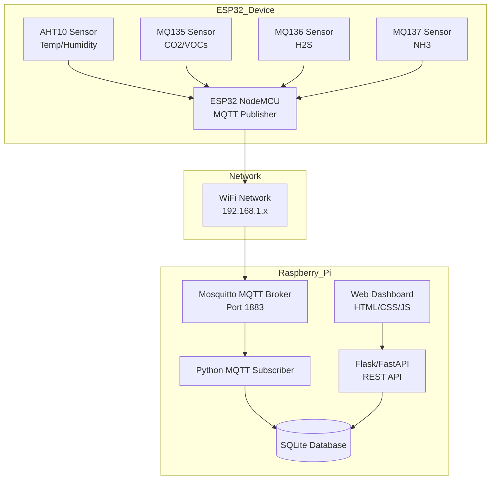
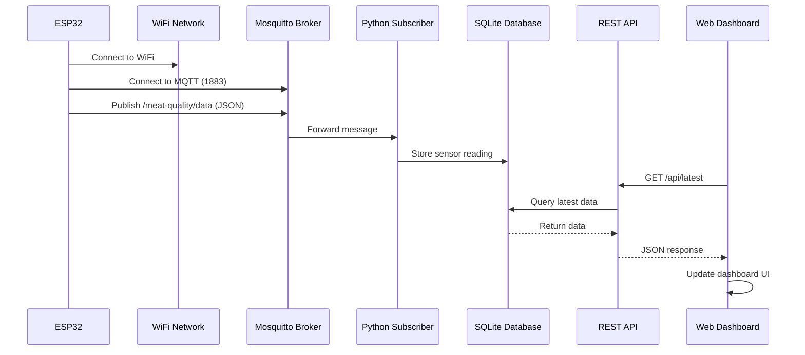

# MQTT Integration Plan - Meat Quality Monitoring System

## Overview
This plan outlines the integration of MQTT communication between the ESP32 meat quality monitor and Raspberry Pi for data storage and visualization.

---

## Architecture Overview



---

## Data Flow



---

## Answer to Your Questions

### 1. Do the ESP32 and Raspberry Pi need to access the same WiFi?

**YES** - For a local MQTT broker setup, both devices must be on the same WiFi network.

**Why:**
- The Mosquitto broker runs on the Raspberry Pi at a local IP address (e.g., `192.168.1.100`)
- The ESP32 needs to connect to this IP address on port 1883 to publish messages
- If devices are on different networks, you would need:
  - Port forwarding (not recommended for security)
  - VPN between networks
  - Or use a cloud-based MQTT broker instead

**Alternative:** If you cannot have them on the same network, consider using a cloud MQTT broker (HiveMQ Cloud, Mosquitto Cloud, AWS IoT Core).

---

### 2. What other things need to be addressed?

#### Network Configuration
- **Static IP for Raspberry Pi**: Configure a static IP so the ESP32 can always find the broker
- **Port 1883**: Ensure MQTT port is not blocked by firewall
- **Network stability**: Consider WiFi signal strength and interference

#### Security Considerations
- **MQTT Authentication**: Use username/password for broker access
- **TLS/SSL**: Consider using MQTT over TLS (port 8883) for encrypted communication
- **Network isolation**: Consider creating a separate IoT network segment

#### Reliability Features
- **QoS Levels**: Use QoS 1 (at least once) or QoS 2 (exactly once) for critical data
- **Retain Messages**: Use retain flag for latest sensor reading
- **Reconnection Logic**: ESP32 must handle WiFi and MQTT reconnection automatically
- **Last Will and Testament**: Configure LWT to detect ESP32 disconnection

#### Data Management
- **Database Schema**: Design efficient schema for time-series sensor data
- **Data Retention**: Plan for data archival or cleanup (SQLite can grow large)
- **Backup Strategy**: Regular database backups

#### Power Management
- **ESP32 Power**: Ensure stable power supply for continuous operation
- **Battery Backup**: Consider UPS for Raspberry Pi during power outages

#### Monitoring & Alerts
- **Connection Monitoring**: Track ESP32 connectivity status
- **Data Validation**: Check for sensor anomalies or missing data
- **Alert System**: Notify when meat quality drops or connection is lost

---

## ESP32 Implementation Details

### Required Libraries
Add to `platformio.ini`:
```ini
lib_deps =
    adafruit/Adafruit AHTX0@^2.0.4
    adafruit/Adafruit BusIO@^1.14.5
    knolleary/PubSubClient@^2.8
    bblanchon/ArduinoJson@^6.21.3
```

### MQTT Configuration Parameters
```cpp
// MQTT Broker Settings
const char* mqttBroker = "192.168.1.100";  // Raspberry Pi IP
const int mqttPort = 1883;
const char* mqttClientId = "ESP32-MeatMonitor";
const char* mqttUser = "meat_monitor";
const char* mqttPassword = "your_secure_password";

// MQTT Topics
const char* topicData = "meat-quality/data";
const char* topicStatus = "meat-quality/status";
const char* topicLWT = "meat-quality/lwt";  // Last Will and Testament
```

### JSON Payload Structure
```json
{
  "timestamp": "2026-02-07T12:00:00Z",
  "device_id": "ESP32-MeatMonitor",
  "sensors": {
    "temperature": 3.5,
    "humidity": 75.0,
    "mq135_co2": 450.0,
    "mq136_h2s": 15.0,
    "mq137_nh3": 25.0
  },
  "quality": {
    "score": 95,
    "level": "EXCELLENT"
  },
  "wifi_rssi": -45,
  "sensor_status": {
    "aht10": true,
    "mq135": true,
    "mq136": false,
    "mq137": true
  }
}
```

---

## Raspberry Pi Implementation Details

### Mosquitto Broker Setup
```bash
# Install Mosquitto
sudo apt update
sudo apt install mosquitto mosquitto-clients

# Configure authentication
sudo mosquitto_passwd -c /etc/mosquitto/passwd meat_monitor

# Edit configuration
sudo nano /etc/mosquitto/mosquitto.conf
```

### Mosquitto Configuration
```conf
listener 1883
allow_anonymous false
password_file /etc/mosquitto/passwd

# Enable persistence
persistence true
persistence_location /var/lib/mosquitto/

# Logging
log_dest file /var/log/mosquitto/mosquitto.log
```

### Database Schema (SQLite)
```sql
CREATE TABLE sensor_readings (
    id INTEGER PRIMARY KEY AUTOINCREMENT,
    timestamp DATETIME DEFAULT CURRENT_TIMESTAMP,
    device_id TEXT,
    temperature REAL,
    humidity REAL,
    mq135_co2 REAL,
    mq136_h2s REAL,
    mq137_nh3 REAL,
    quality_score INTEGER,
    quality_level TEXT,
    wifi_rssi INTEGER
);

CREATE TABLE device_status (
    id INTEGER PRIMARY KEY AUTOINCREMENT,
    timestamp DATETIME DEFAULT CURRENT_TIMESTAMP,
    device_id TEXT,
    status TEXT,  -- online/offline
    last_seen DATETIME
);

CREATE INDEX idx_timestamp ON sensor_readings(timestamp);
CREATE INDEX idx_device ON sensor_readings(device_id);
```

### Python Subscriber Script Structure
```python
import paho.mqtt.client as mqtt
import sqlite3
import json
from datetime import datetime

# MQTT Configuration
BROKER = "localhost"
PORT = 1883
USER = "meat_monitor"
PASSWORD = "your_password"
TOPIC = "meat-quality/data"

def on_connect(client, userdata, flags, rc):
    print(f"Connected with result code {rc}")
    client.subscribe(TOPIC)

def on_message(client, userdata, msg):
    data = json.loads(msg.payload)
    # Store in database
    store_reading(data)

def store_reading(data):
    conn = sqlite3.connect('meat_quality.db')
    cursor = conn.cursor()
    # Insert logic here
    conn.commit()
    conn.close()
```

### Web Dashboard Technology Stack
- **Backend**: Flask or FastAPI (Python)
- **Database**: SQLite
- **Frontend**: HTML5, CSS3, JavaScript (Vanilla or Vue.js)
- **Charts**: Chart.js or ApexCharts
- **Real-time Updates**: Server-Sent Events (SSE) or polling

---

## Testing Checklist

### Phase 1: ESP32 MQTT Publishing
- [ ] ESP32 connects to WiFi successfully
- [ ] ESP32 connects to MQTT broker
- [ ] ESP32 publishes JSON payload to correct topic
- [ ] Serial monitor shows MQTT publish status
- [ ] QoS settings work as expected

### Phase 2: Raspberry Pi MQTT Reception
- [ ] Mosquitto broker is running and accessible
- [ ] Python subscriber connects to broker
- [ ] Subscriber receives messages from ESP32
- [ ] Data is parsed correctly from JSON
- [ ] Data is stored in SQLite database

### Phase 3: Web Dashboard
- [ ] API endpoint returns latest sensor data
- [ ] API endpoint returns historical data
- [ ] Dashboard displays real-time data
- [ ] Dashboard displays historical charts
- [ ] Dashboard updates automatically

### Phase 4: Integration & Reliability
- [ ] ESP32 reconnects after WiFi loss
- [ ] ESP32 reconnects after MQTT broker restart
- [ ] Data continuity during reconnection
- [ ] Database handles concurrent writes
- [ ] System runs for 24+ hours without issues

---

## File Structure

### ESP32 Project
```
meat_quality_Air_data/
├── platformio.ini
├── src/
│   ├── main.cpp           # Main firmware with MQTT
│   ├── config.h           # Configuration parameters
│   └── mqtt_client.h      # MQTT client wrapper
└── README.md
```

### Raspberry Pi Project
```
/home/pi/meat-quality-system/
├── mqtt_subscriber/
│   ├── subscriber.py      # MQTT to database script
│   └── requirements.txt   # Python dependencies
├── api/
│   ├── app.py             # Flask/FastAPI application
│   └── requirements.txt
├── dashboard/
│   ├── index.html
│   ├── css/
│   ├── js/
│   └── assets/
├── data/
│   └── meat_quality.db    # SQLite database
├── logs/
│   └── subscriber.log
└── README.md
```

---

## Next Steps

Once you approve this plan, switch to **Code** mode to implement:
1. ESP32 MQTT client modifications
2. Raspberry Pi Mosquitto setup
3. Python subscriber script
4. Web dashboard

Or switch to **Debug** mode if you encounter any issues during implementation.
