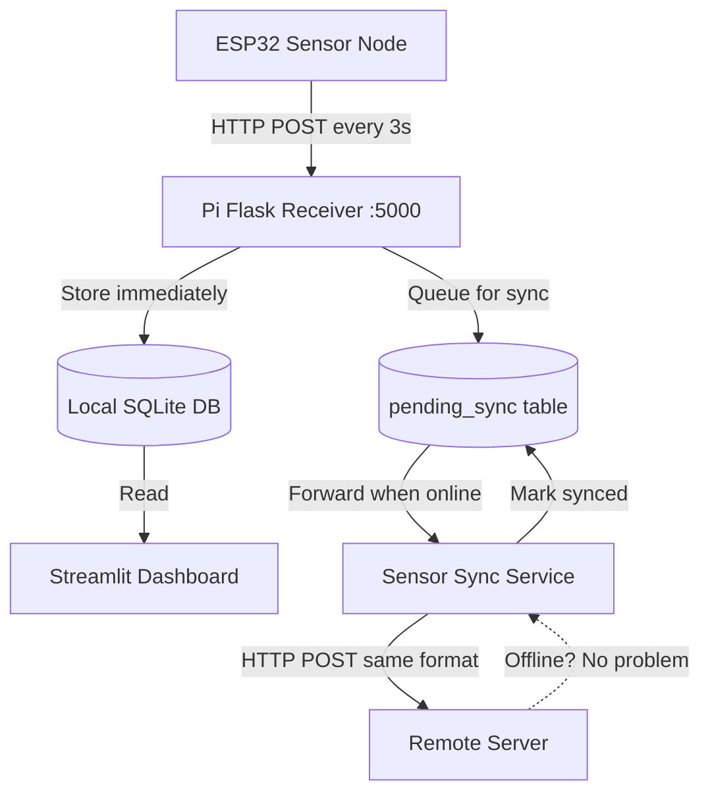

# ESP32 → Pi Direct Routing Plan

## Problem Statement

The remote IoT server (`meat-monitor.kalobiral.com.bd`) is offline. Currently, the data flow is:

```
ESP32 → Remote Server → Pi polls server → Local SQLite → Dashboard
```

When the server is down, **no data reaches the Pi or dashboard at all**.

## Proposed New Architecture

```
ESP32 → Pi Receiver (Flask) → Local SQLite → Dashboard (realtime)
                                ↓ (async sync)
                          Remote Server (when online)
```

### Data Flow Diagram



## Key Design Decisions

1. **ESP32 sends to Pi instead of server** — Change `API_URL` to `http://100.108.189.32:5000/api/meat-data`
2. **Pi Flask receiver accepts the exact same JSON** — No format changes needed
3. **Pi stores data immediately in SQLite** — Dashboard shows realtime data
4. **Pi queues data for async sync** — Separate background service forwards to remote server
5. **Server format unchanged** — Pi forwards the exact same JSON payload the ESP32 was sending
6. **If server is offline** — Data is safe in Pi SQLite + pending_sync queue; sync retries later

---

## Files to Modify

### 1. ESP32 Code — `meat_quality_Air_data_ESP_Node/ESP_sensor_node/src/main.cpp`

**Change:** Update `API_URL` from remote server to Pi Tailscale IP

```cpp
// BEFORE:
const char* API_URL = "https://meat-monitor.kalobiral.com.bd/api/meat-data";

// AFTER:
const char* API_URL = "http://100.108.189.32:5000/api/meat-data";
```

That is the **only** ESP32 change. The JSON format, API key, offline queue, and all other logic remain identical.

### 2. New File — `meat-quality-monitoring/sensor_receiver.py`

A lightweight Flask server that:
- Listens on `0.0.0.0:5000` (Tailscale accessible)
- Endpoint: `POST /api/meat-data` — accepts the same JSON + `X-API-Key` header
- Validates the API key
- Stores the reading in `sensor_readings` table via `db_manager`
- Stores the raw JSON in `pending_sync` table for later forwarding
- Returns HTTP 201 to ESP32

### 3. New File — `meat-quality-monitoring/sensor_sync.py`

A background service (similar to `meat_monitor_client.py`) that:
- Reads pending entries from `pending_sync` table
- Forwards each to `https://meat-monitor.kalobiral.com.bd/api/meat-data` using the same API key
- Marks entries as synced on success
- Retries with exponential backoff on failure
- Runs continuously as a systemd service

### 4. Modify — `meat-quality-monitoring/db_manager.py`

Add a new `pending_sync` table to the schema:

```sql
CREATE TABLE IF NOT EXISTS pending_sync (
    id INTEGER PRIMARY KEY AUTOINCREMENT,
    local_reading_id INTEGER,
    payload_json TEXT NOT NULL,
    sync_status TEXT DEFAULT 'pending',  -- pending, synced, failed
    created_at DATETIME DEFAULT CURRENT_TIMESTAMP,
    synced_at DATETIME,
    retry_count INTEGER DEFAULT 0,
    FOREIGN KEY (local_reading_id) REFERENCES sensor_readings(id)
)
```

Add methods:
- `queue_for_sync(reading_id, payload_json)` — Insert into pending_sync
- `get_pending_sync(limit)` — Get unsynced entries
- `mark_synced(sync_id)` — Mark as synced
- `increment_retry(sync_id)` — Increment retry count

### 5. Modify — `meat-quality-monitoring/config.py`

Add new configuration section:

```python
# Pi Receiver Configuration
PI_RECEIVER_HOST = "0.0.0.0"
PI_RECEIVER_PORT = 5000
PI_RECEIVER_API_KEY = "aa8a531a309e574c7fef976850416e7613984ba03f4cf370"

# Sensor Sync Configuration  
SENSOR_SYNC_INTERVAL = 5  # seconds between sync attempts
SENSOR_SYNC_BATCH_SIZE = 3  # entries per sync cycle
SENSOR_SYNC_MAX_RETRIES = 100  # max retries before giving up
```

### 6. Modify — `meat-quality-monitoring/app.py`

Minimal changes:
- Update sidebar to show "Direct (Pi Receiver)" as data source instead of "API (Real Sensors)"
- Remove the "Test API Connection" button or repurpose it to test Pi receiver health
- The dashboard already reads from local SQLite — no data pipeline changes needed

### 7. New File — `meat-quality-monitoring/deploy/pi-sensor-receiver.service`

```ini
[Unit]
Description=Meat Quality Sensor Receiver
After=network.target

[Service]
Type=simple
User=pi
WorkingDirectory=/home/pi/meat-quality-monitoring
ExecStart=/usr/bin/python3 sensor_receiver.py
Restart=always
RestartSec=5

[Install]
WantedBy=multi-user.target
```

### 8. New File — `meat-quality-monitoring/deploy/pi-sensor-sync.service`

```ini
[Unit]
Description=Meat Quality Sensor Sync to Remote Server
After=network.target

[Service]
Type=simple
User=pi
WorkingDirectory=/home/pi/meat-quality-monitoring
ExecStart=/usr/bin/python3 sensor_sync.py
Restart=always
RestartSec=10

[Install]
WantedBy=multi-user.target
```

### 9. Deprecate — `meat-quality-monitoring/meat_monitor_client.py`

This file polled the remote server for data. It is **no longer needed** since data now arrives directly from ESP32. The new `sensor_sync.py` replaces its role — but in reverse (pushing data out instead of pulling it in).

The systemd service `deploy/meat-monitor-client.service` should be disabled on the Pi:

```bash
sudo systemctl disable meat-monitor-client.service
sudo systemctl stop meat-monitor-client.service
```

---

## Deployment Steps on Raspberry Pi

1. **Deploy updated code** to Pi
2. **Install new systemd services:**
   ```bash
   sudo cp deploy/pi-sensor-receiver.service /etc/systemd/system/
   sudo cp deploy/pi-sensor-sync.service /etc/systemd/system/
   sudo systemctl daemon-reload
   sudo systemctl enable pi-sensor-receiver.service
   sudo systemctl enable pi-sensor-sync.service
   sudo systemctl start pi-sensor-receiver.service
   sudo systemctl start pi-sensor-sync.service
   ```
3. **Disable old polling client:**
   ```bash
   sudo systemctl disable meat-monitor-client.service
   sudo systemctl stop meat-monitor-client.service
   ```
4. **Verify Tailscale is running** and `100.108.189.32` is accessible
5. **Flash ESP32** with updated `API_URL`
6. **Verify data flow:** Check `sensor_receiver.py` logs for incoming data

## ESP32 JSON Payload (Unchanged)

For reference, the JSON format the ESP32 sends (and the Pi receiver must accept):

```json
{
  "device_id": "ESP32-MeatMonitor",
  "timestamp": "2026-05-17T06:15:00Z",
  "sensors": {
    "temperature": 25.0,
    "humidity": 60.0,
    "mq135_co2": 450.0,
    "mq136_h2s": 5.0,
    "mq137_nh3": 15.0
  },
  "quality": {
    "level": "EXCELLENT"
  },
  "wifi_rssi": -45,
  "sensor_status": {
    "aht10_ready": true,
    "aht10_read_ok": true,
    "time_source": "ntp"
  }
}
```

Headers:
- `Content-Type: application/json`
- `X-API-Key: aa8a531a309e574c7fef976850416e7613984ba03f4cf370`

## Benefits

- **Server offline? No problem** — Data is stored on Pi immediately
- **Zero server changes** — Pi forwards data in the exact same format
- **Realtime dashboard** — No polling delay; data appears as soon as ESP32 sends it
- **Automatic catch-up** — When server comes back online, pending data syncs automatically
- **ESP32 offline queue still works** — If Pi is temporarily unreachable, ESP32 queues up to 20 readings
