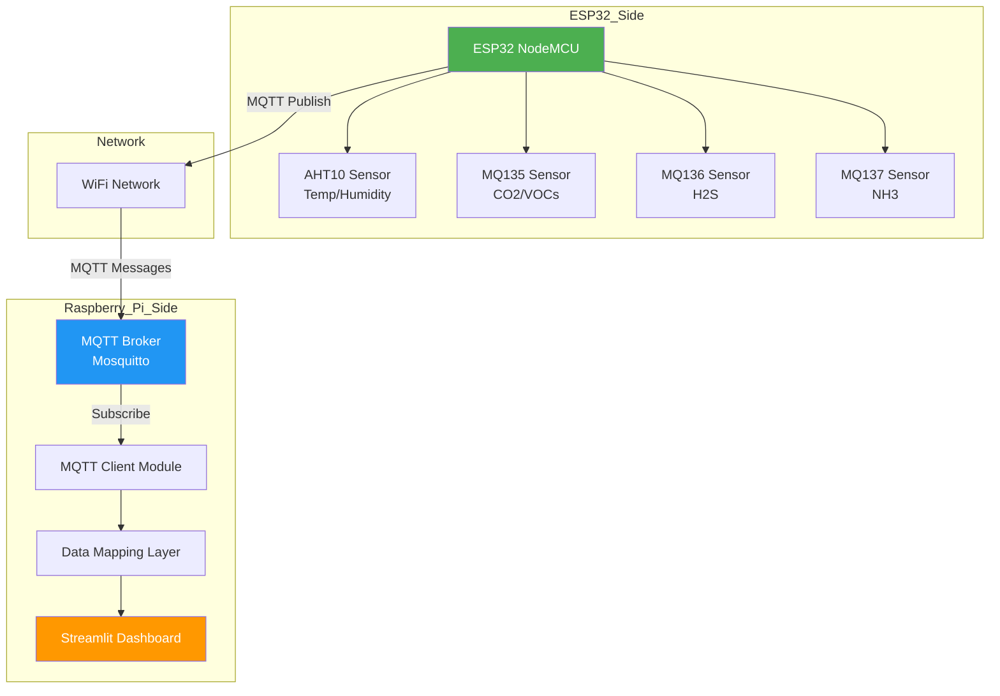
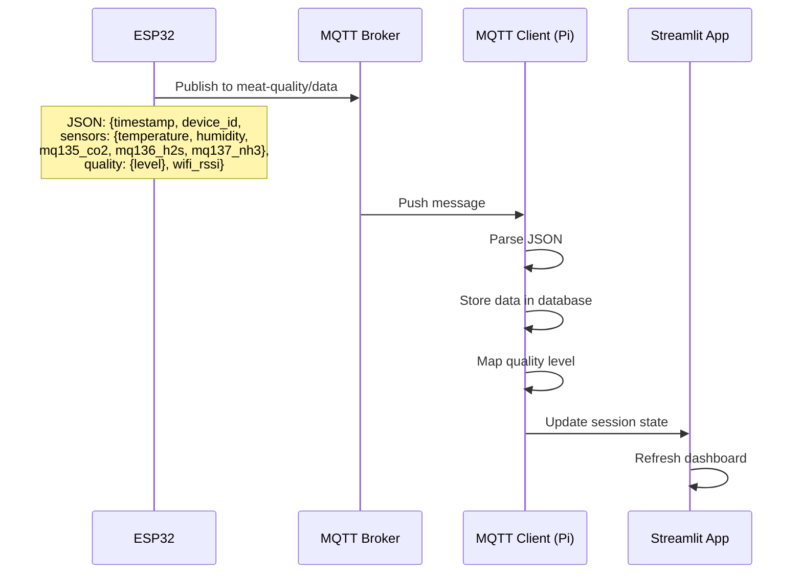

# Meat Quality Monitoring System - ESP32 & Raspberry Pi Integration Plan

## Overview

This document outlines the integration plan to connect the ESP32 meat quality monitoring system with the Raspberry Pi Streamlit dashboard using MQTT as the communication protocol. This implementation is based on the research work "IoT Based Meat Freshness Classification Using Deep Learning" which combines gas sensors (H2S, NH3, CO2) with computer vision for multi-modal meat quality assessment.

## Research Context

Based on the research paper, the system uses:
- **Gas Sensors**: H2S (MQ136), NH3 (MQ137), CO2/VOCs (MQ135) for olfactory analysis
- **Computer Vision**: Custom CNN for visual freshness classification
- **Multi-Modal Fusion**: Combining gas sensor readings with visual predictions for accurate quality assessment

---

## System Architecture



---

## Data Flow Diagram



---

## Integration Gaps & Solutions

### 1. Sensor Mapping

| ESP32 Sensor | Pi Dashboard Display | Mapping |
|--------------|---------------------|---------|
| MQ135 (CO2/VOCs) | CO2 (MQ135) | Direct mapping ✓ |
| MQ136 (H2S) | H2S (MQ136) | Direct mapping ✓ |
| MQ137 (NH3) | NH3 (MQ137) | Direct mapping ✓ |

**Note:** Based on the research paper, NH3 (Ammonia) is a key indicator of meat spoilage and should be displayed directly rather than mapped to Methane.

### 2. Quality Level Mapping

| ESP32 Quality | Pi Dashboard Status | Criteria |
|---------------|-------------------|----------|
| EXCELLENT | SAFE | All sensors within fresh thresholds |
| GOOD | SAFE | Minor deviations, still safe |
| FAIR | WARNING | Early signs of spoilage |
| POOR | WARNING | Significant spoilage indicators |
| SPOILED | SPOILED/CRITICAL | Critical gas levels exceeded |

### 3. Historical Data Storage

A SQLite database will be implemented to store historical sensor readings for:
- Long-term trend analysis
- Historical data visualization
- Data export capabilities
- Machine learning model training data

**Database Schema:**

```sql
-- Sensor readings table
CREATE TABLE sensor_readings (
    id INTEGER PRIMARY KEY AUTOINCREMENT,
    timestamp DATETIME DEFAULT CURRENT_TIMESTAMP,
    device_id TEXT,
    temperature REAL,
    humidity REAL,
    mq135_co2 REAL,
    mq136_h2s REAL,
    mq137_nh3 REAL,
    quality_level TEXT,
    wifi_rssi INTEGER
);

-- Visual predictions table
CREATE TABLE visual_predictions (
    id INTEGER PRIMARY KEY AUTOINCREMENT,
    timestamp DATETIME DEFAULT CURRENT_TIMESTAMP,
    species TEXT,
    visual_status TEXT,
    confidence REAL
);

-- Fusion decisions table
CREATE TABLE fusion_decisions (
    id INTEGER PRIMARY KEY AUTOINCREMENT,
    timestamp DATETIME DEFAULT CURRENT_TIMESTAMP,
    visual_status TEXT,
    gas_status TEXT,
    fusion_status TEXT
);
```

### 4. MQTT Configuration Requirements

#### ESP32 Side (esp_code.cpp)
- Update `mqttBroker` to Raspberry Pi's IP address
- Set `mqttUser` and `mqttPassword` for authentication

#### Raspberry Pi Side
- Install and configure Mosquitto MQTT broker
- Create MQTT client module to subscribe to topics

---

## MQTT Topics

| Topic | Direction | Purpose |
|-------|-----------|---------|
| `meat-quality/data` | ESP → Pi | Sensor readings JSON |
| `meat-quality/status` | ESP → Pi | Device status (online/offline) |
| `meat-quality/lwt` | ESP → Pi | Last Will and Testament |
| `meat-quality/commands` | Pi → ESP | Optional command channel |

---

## JSON Data Format (from ESP32)

```json
{
  "timestamp": "12345678",
  "device_id": "ESP32-MeatMonitor",
  "sensors": {
    "temperature": 3.5,
    "humidity": 75.0,
    "mq135_co2": 450.0,
    "mq136_h2s": 15.0,
    "mq137_nh3": 25.0
  },
  "quality": {
    "level": "GOOD"
  },
  "wifi_rssi": -45,
  "sensor_status": {
    "aht10": true,
    "mq135": true,
    "mq136": true,
    "mq137": true
  }
}
```

---

## Implementation Plan

### Phase 1: ESP32 Configuration
1. Update MQTT broker IP in `esp_code.cpp`
2. Set MQTT username and password
3. Verify MQTT connection

### Phase 2: Raspberry Pi MQTT Setup
1. Install Mosquitto MQTT broker
2. Configure authentication
3. Enable remote connections

### Phase 3: Database Setup
1. Create `db_manager.py` module
2. Implement SQLite database initialization
3. Create database schema
4. Add CRUD operations for sensor data

### Phase 4: Python MQTT Client
1. Create `mqtt_client.py` module
2. Implement MQTT subscription
3. Add data parsing and storage to database
4. Implement reconnection logic

### Phase 5: Dashboard Integration
1. Update `requirements.txt` with `paho-mqtt` and database dependencies
2. Modify `app.py` to use MQTT data from database
3. Update UI to display NH3 (MQ137) instead of Methane
4. Add historical data visualization
5. Add data export functionality
6. Add fallback to mock data when MQTT unavailable
7. Update UI to show connection status

### Phase 6: Testing & Deployment
1. Test end-to-end data flow
2. Verify sensor mappings
3. Test database storage and retrieval
4. Test reconnection logic
5. Document deployment steps

---

## File Structure After Integration

```
meat-quality-monitoring/
├── app.py                    # Modified to use MQTT data + database
├── mock_data.py              # Kept as fallback
├── mqtt_client.py            # NEW: MQTT client module
├── db_manager.py             # NEW: Database management module
├── config.py                 # NEW: Configuration file
├── requirements.txt          # Updated with paho-mqtt
├── data/                     # NEW: Data directory
│   └── meat_quality.db       # SQLite database (auto-created)
├── README.md                 # Updated
└── plans/
    └── meat-quality-monitoring-integration.md  # This file

esp_code.cpp                  # Updated MQTT config
```

---

## Configuration Parameters

### Raspberry Pi (config.py)
```python
# MQTT Configuration
MQTT_BROKER = "localhost"  # Mosquitto runs on Pi
MQTT_PORT = 1883
MQTT_TOPIC = "meat-quality/data"
MQTT_USERNAME = "meat_monitor"
MQTT_PASSWORD = "your_secure_password"
```

### ESP32 (esp_code.cpp)
```cpp
const char* mqttBroker = "192.168.1.XXX";  // Raspberry Pi IP
const char* mqttUser = "meat_monitor";
const char* mqttPassword = "your_secure_password";
```

---

## Database Configuration

### SQLite Database Location
- Default path: `meat-quality-monitoring/data/meat_quality.db`
- Auto-created on first run
- No additional installation required (Python built-in)

### Database Management
- Automatic cleanup of old records (configurable retention period)
- Indexes for efficient querying
- Backup functionality

## Mosquitto MQTT Broker Setup

### Installation Commands
```bash
sudo apt update
sudo apt install mosquitto mosquitto-clients
sudo systemctl enable mosquitto
sudo systemctl start mosquitto
```

### Configuration File (/etc/mosquitto/mosquitto.conf)
```
listener 1883
allow_anonymous false
password_file /etc/mosquitto/passwd
```

### Create User
```bash
sudo mosquitto_passwd -c /etc/mosquitto/passwd meat_monitor
# Enter password when prompted
sudo systemctl restart mosquitto
```

---

## Fallback Strategy

The dashboard will support three modes:
1. **MQTT Mode** (Primary): Real data from ESP32
2. **Mock Mode** (Fallback): Simulated data for testing
3. **Hybrid Mode**: MQTT data with mock fallback on disconnect

---

## Security Considerations

1. Use strong MQTT passwords
2. Enable TLS/SSL for production (port 8883)
3. Restrict MQTT broker to local network
4. Implement client certificate authentication if needed
5. Regularly update Mosquitto and dependencies

---

## Testing Checklist

- [ ] ESP32 connects to WiFi
- [ ] ESP32 connects to MQTT broker
- [ ] ESP32 publishes data to `meat-quality/data`
- [ ] Raspberry Pi receives MQTT messages
- [ ] Dashboard displays real sensor values
- [ ] Sensor mappings work correctly
- [ ] Quality level mapping works correctly
- [ ] Reconnection works after WiFi/MQTT disconnect
- [ ] Fallback to mock data works when MQTT unavailable
- [ ] Dashboard auto-refreshes with new data

---

## Troubleshooting

### Common Issues

| Issue | Possible Cause | Solution |
|-------|---------------|----------|
| ESP cannot connect to MQTT | Wrong IP address | Check Pi IP with `hostname -I` |
| MQTT connection refused | Mosquitto not running | `sudo systemctl status mosquitto` |
| Authentication failed | Wrong credentials | Verify username/password in config |
| No data in dashboard | Wrong topic | Check topic name matches ESP |
| Dashboard shows old data | Auto-refresh issue | Check Streamlit rerun logic |

---

## Next Steps

After approval of this plan:
1. Switch to Code mode to implement the changes
2. Create/update configuration files
3. Implement MQTT client module
4. Modify dashboard application
5. Test the integration
